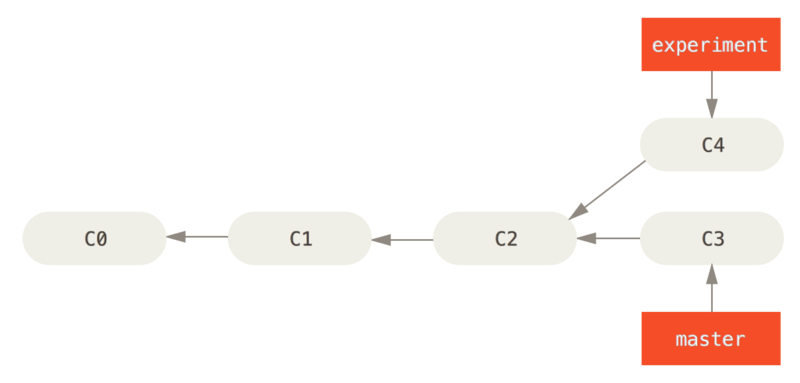
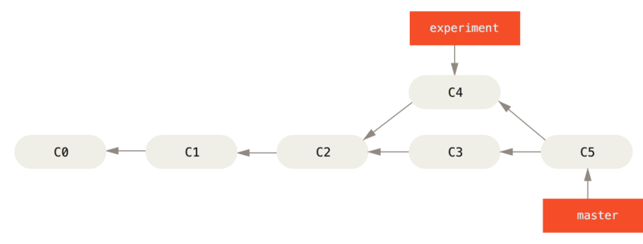
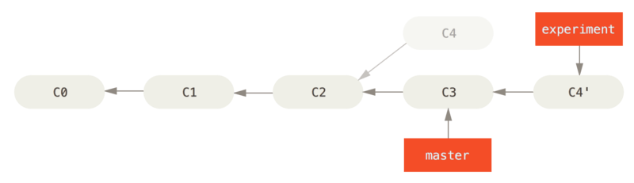
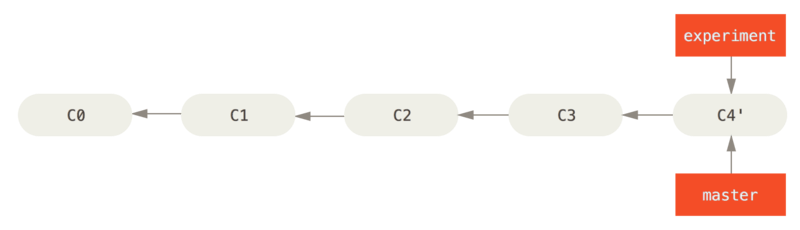

# 分支

分支的本质实际上是一个指针，本身不存储实际的数据。

## 本地分支管理

### 分支的创建

- 创建新分支但是不离开当前工作分支
```
git branch newbranch
```
- 创建并进入新分支
```
git branch -b newbranch
```

### 分支环境切换 

- 切换到本地指定分支环境
```
git checkout mybranch
```

### 分支信息合并

分支合并前:



#### merge

merge会把两个分支的最新快照以及二者最近的共同祖先进行三方合并，合并的结果是生成一个新的快照（并提交），分支各自的提交历史保留且独立。

```
git checkout master
git merge hotfix
```

分支合并后：



#### rebase

rebase 命令将提交到某一分支上的所有修改都移至另一分支上，就好像“重新播放”一样。

```
git checkout experiment
git rebase master
```

分支合并后：



合并后做一次快进：
```
git checkout master
git merge experiment
```

最终结果：



## 远程分支管理

### 信息查看

- 查询指定仓库详情
```
git remote show ymc-nas
```
- 查询本地分支详情
```
git branch -vv
```

### 分支信息更新

- 获取远程仓库所有分支更新信息，但是不更新本地分支
```
git fetch --all 
```
- 将本地1st-edition分支推送到远程仓库上的同名分支
```
git push ymc-nas 1st-edition
```
- 将本地的 serverfix 分支推送到远程仓库上的 awesomebranch 分支
```
git push origin serverfix:awesomebranch 
```

### 跟踪分支

从一个远程跟踪分支检出一个本地分支会自动创建一个叫做 “跟踪分支”（有时候也叫做 “上游分支”）。 跟踪分支是与远程分支有直接关系的本地分支。 如果在一个跟踪分支上输入 git pull，Git 能自动地识别去哪个服务器上抓取、合并到哪个分支。

- 新建并进入一个本地跟踪分支，以下两种方式等效：
```
git checkout -b 1st-edition ymc-nas/1st-edition
git checkout --track ymc-nas/1st-edition
```
- 设置或修改当前分支跟踪的远程分支，以下两种方式等效：
```
git branch -u ymc-nas/1st-edition
git branch --set-upstream-to ymc-nas/1st-edition
```

### 删除远程分支

1. 删除远程仓库分支
```
git push origin --delete serverfix
```
2. 删除本地无效的远程跟踪分支
```
git remote prune origin
```
